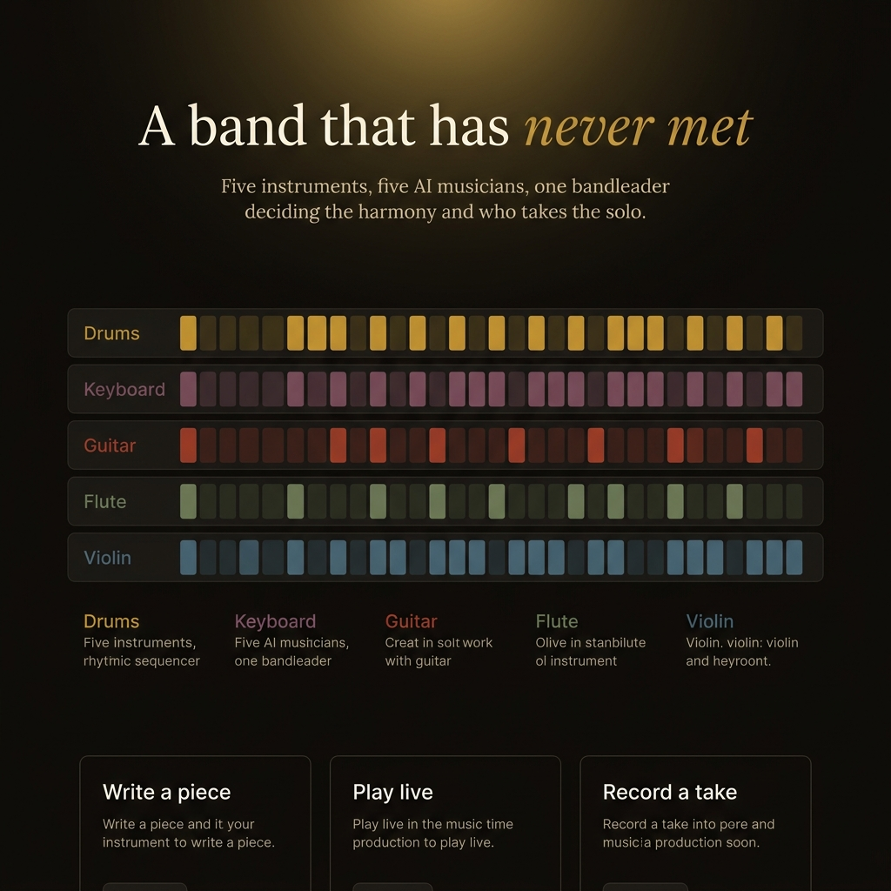
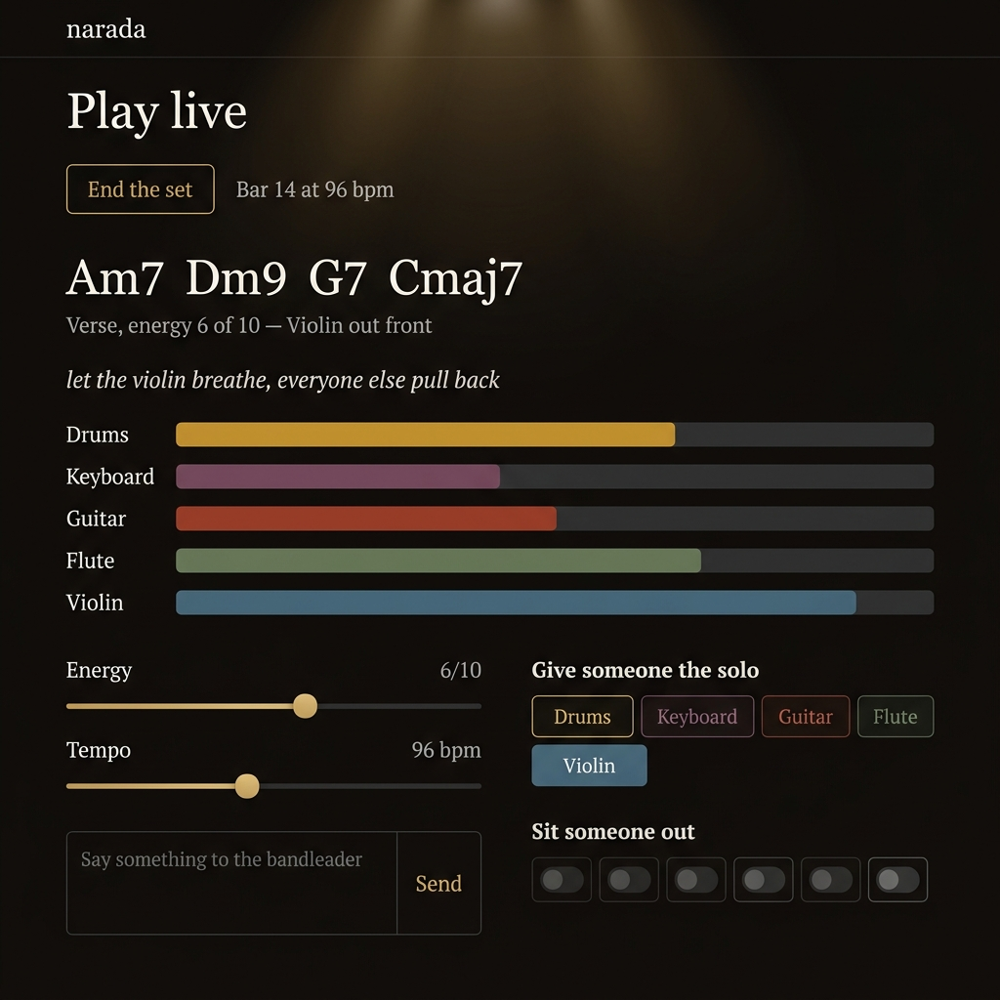

<p align="center">
  
</p>

<h1 align="center">🎵 NARADA</h1>

<p align="center">
  <strong>Five instruments. Five AI agents. One bandleader. Zero rehearsals.</strong><br/>
  <em>Named for Narada, the wandering sage who travels between worlds with a veena in hand.</em>
</p>

<p align="center">
  <a href="LICENSE"></a>
  
  
  
  
</p>

---

Drums, keyboard, guitar, flute and violin — each played by its own AI agent,
under a bandleader that decides harmony, form, energy and who takes the solo.
They write their parts bar by bar while you listen. No samples, no loops — every
note is decided in the moment.

## ✨ What you can do

| Mode | What happens |
|------|-------------|
| 🎼 **Composer** | Brief the bandleader in plain English. Get a full five-part arrangement. |
| 🎸 **Live jam** | The band plays continuously. Steer energy, tempo, mood, hand out solos, sit players down. |
| 🎙️ **Studio** | Hit record. Leave with audio and five separate MIDI stems. |
| 🤖 **MCP server** | Any MCP client (Claude Code, etc.) can play the instruments directly as tools. |

## 🖥️ Screenshots

<p align="center">
  
  <br/>
  <em>Live jam — chord changes, per-player meters, energy sliders, and solo control</em>
</p>

## 🧠 How it works

The browser owns the clock. It plays bar *N* while the backend generates bar
*N+2*: the bandleader issues a section cue, then all five instrument agents
write their bar **in parallel**, and each bar streams back over a WebSocket. If a
bar arrives late the engine repeats the previous one — the music never stops.

Agents emit **notes as data, not audio** — which is why you can mute one
instrument, hand it a solo mid-song, or export it as its own MIDI stem. They
can also design their own synth patches (a validated shape, never executable
code) when they want a different sound.

```text
 YOU
  │ "rainy evening, violin carries it"
  ▼
┌─────────────────────────────────────────────┐
│  BROWSER (Next.js + Tone.js)                │
│  owns the clock, plays the sound            │
│  ── BandEngine · BarBuffer · 5 Voices ──    │
└────────┬────────────────────────┬───────────┘
         │ REST                   │ WebSocket
         ▼                       ▼
┌─────────────────────────────────────────────┐
│  API (FastAPI)                              │
│                                             │
│  Bandleader → section cue (chords, energy)  │
│       │                                     │
│       ├── drums   ─┐                        │
│       ├── keys     │ 5 agents in parallel   │
│       ├── guitar   │ one bar at a time      │
│       ├── flute    │                        │
│       └── violin  ─┘                        │
│                                             │
│  → any OpenAI-compatible LLM                │
└─────────────────────────────────────────────┘
```

## 🎻 The band

Each player has a character, a register, and real articulations — not just
pitch/velocity. The violin can bow or pluck. The guitar can palm-mute. The
drummer names kit pieces, not GM numbers.

| Player | Colour | Role | Voices |
|--------|--------|------|--------|
| 🥁 Drums | Gold | Keeps time | normal, ghost, accent + 23 named kit pieces |
| 🎹 Keyboard | Mauve | Holds the harmony | grand, Rhodes, FM electric, harpsichord, bright |
| 🎸 Guitar | Ember | Rhythm and colour | clean, nylon, palm mute, harmonics, 12-string, overdrive |
| 🪈 Flute | Olive | A single voice | flute, recorder, pan flute |
| 🎻 Violin | Steel | Carries the melody | sustain, pizzicato, tremolo, harp |

## 🚀 Get started

```bash
# 1. Clone
git clone https://github.com/lebiraja/narada.git
cd narada

# 2. Configure
cp .env.example .env
# Edit .env — set LLM_API_KEY at minimum
# Works with any OpenAI-compatible endpoint: Claude, GPT, Groq, Ollama

# 3. (Optional) Fetch instrument samples — synth voices work without them
./scripts/fetch-samples.sh

# 4. Launch
docker compose up -d
```

Once all four services are healthy:

- **UI** → [http://localhost:3000](http://localhost:3000)
- **API docs** → [http://localhost:8000/docs](http://localhost:8000/docs)

## 🧪 Tests

```bash
# Backend — 76 pytest tests
docker compose run --rm --no-deps api pytest

# Frontend — 44 vitest tests
docker compose run --rm --no-deps web npx vitest run

# End-to-end wire check (stubbed model, real app)
docker compose exec -T -e PYTHONPATH=/app api python scripts/wire_check.py
```

## 🔧 Tech stack

| Layer | Tech |
|-------|------|
| Backend | Python 3.13, FastAPI, Pydantic v2, uvicorn |
| Frontend | Next.js 15 (App Router), React 19, Tailwind CSS |
| Audio | Tone.js (Web Audio transport, samplers, synths, recorder) |
| AI | Any OpenAI-compatible endpoint — Claude, GPT, Groq, or local Ollama |
| MIDI | mido (server-side stem rendering) |
| Agent interop | MCP SDK — the band exposed as tools |
| State | Redis (live sessions), PostgreSQL (persistence) |
| Infra | Docker Compose with healthchecks |

## 🎧 Compositions by the band

These were composed entirely by the AI agents — no human-written notes:

| Title | Vibe | Details |
|-------|------|---------|
| *Evening Whisper* | Quiet, D minor, 6/8 at 70bpm | 18 bars — violin switched to pizzicato unprompted for the closing section |
| *Tandava* | Heavy, E aeolian, 7/8 at 132bpm | 28 bars — palm-muted guitar riff, keys covering bass two octaves down |
| *Restless Monsoon Night* | Moody, 6/8 | 20 bars — the agents' first-ever composition, seven bugs found and fixed |
| *Monsoon Letters* | A dorian, 6/8, 84bpm | 16 bars, 328 notes — hand-written through the schema as a proof of concept |

## 📖 Documentation

| Doc | What's inside |
|-----|--------------|
| [Architecture](docs/architecture.md) | Full system design, data models, ASCII flow diagrams |
| [API](docs/API.md) | REST endpoints, WebSocket protocol, MCP tools |
| [Docker](docs/docker.md) | Container setup, healthchecks, volume mounts |
| [Fixes](docs/FIXES.md) | Every bug found and how it was resolved |

## 🤝 Contributing

Contributions are welcome! Whether you're fixing a bug, adding an instrument
voice, improving the frontend, or writing docs — we'd love to have you.

- Read the **[Contributing Guide](CONTRIBUTING.md)** for dev setup, PR guidelines, and code style.
- Please follow our **[Code of Conduct](CODE_OF_CONDUCT.md)**.
- For security issues, see the **[Security Policy](SECURITY.md)**.

## 📄 License

[MIT](LICENSE) — do whatever you want, just keep the copyright notice.

---

<p align="center">
  <em>Built with too much coffee and the belief that AI should jam, not just chat.</em>
</p>
